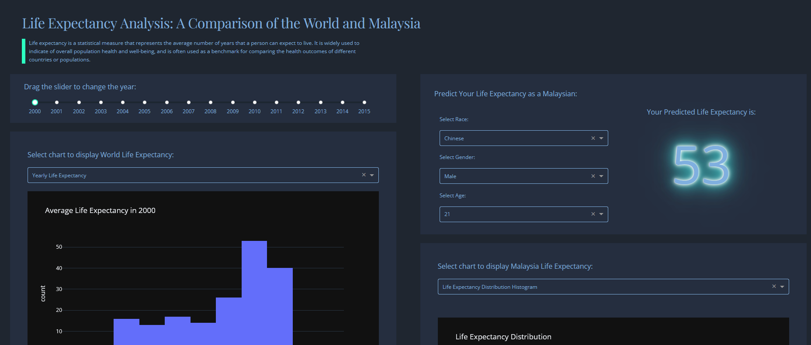
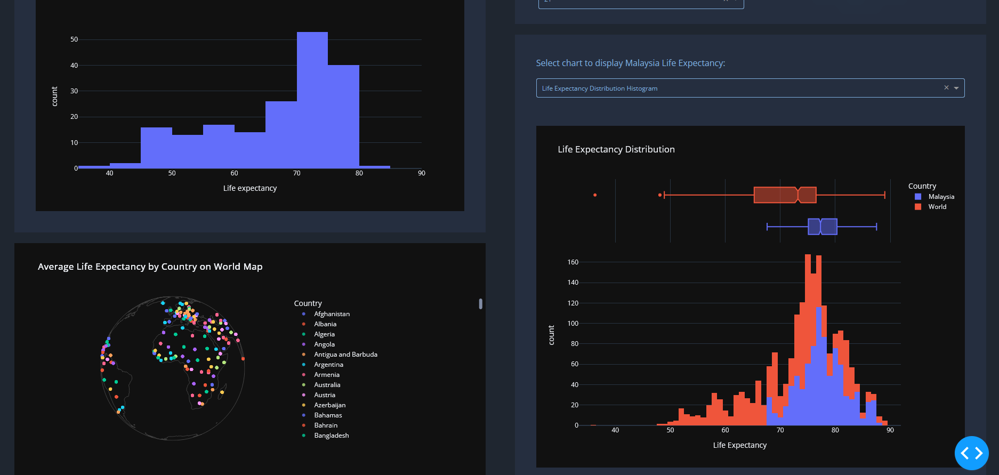
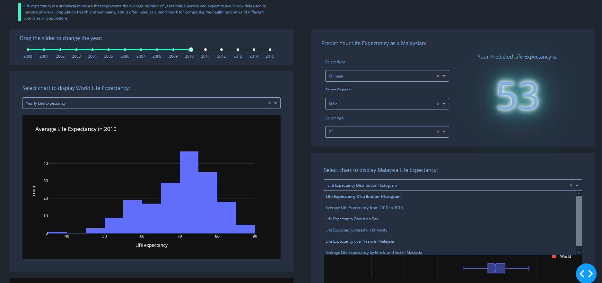

# Life Expectancy Dashboard

## Description
This dashboard provides a visual representation of life expectancy data across different countries and years. It allows users to interactively explore and analyze the data in a user-friendly manner. It also provides a prediction function where users can play around with different input and predict their remaining life expectancy.

## How to Run
1. Clone the repository to your local machine.
2. Navigate to the project directory.
3. Install the required dependencies with pip install -r requirements.txt.
4. Run the dashboard with python app.py.
5. Open a web browser and visit http://127.0.0.1:8050/.

## Screenshots
Here are some screenshots of the dashboard:

